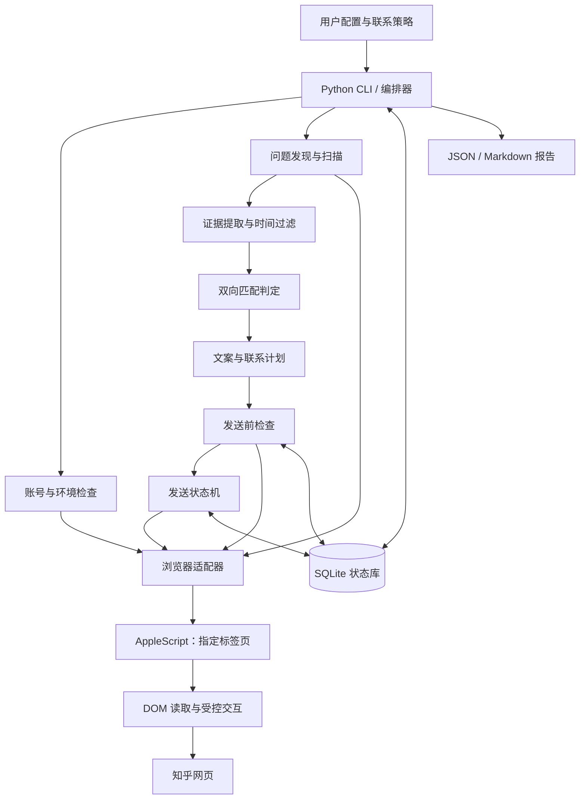
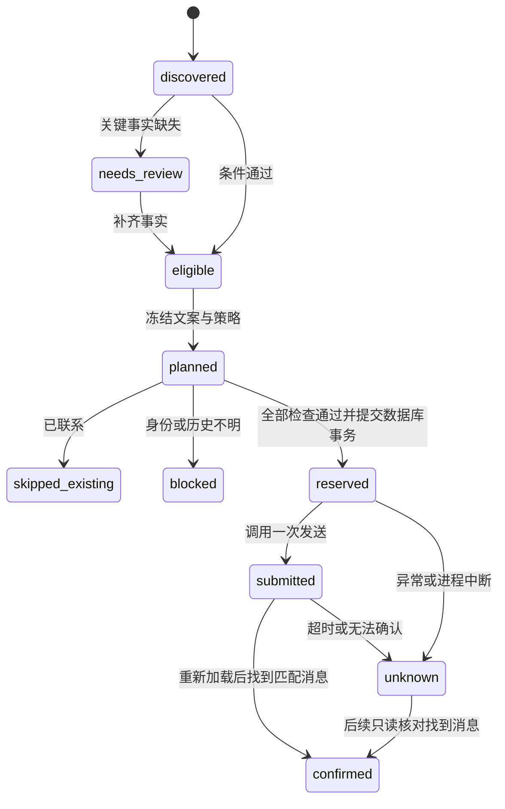

# 知乎交友检索与首次私信助手：系统设计方案

版本：0.1 · 日期：2026-10-04 · 运行环境：macOS + Google Chrome

**设计结论：采用本地 Python 编排、Chrome 已登录会话、页面 DOM 适配、SQLite 持久化的单机架构。检索与发送分离；发送前必须完成账号核验、作者身份关联、条件匹配和历史会话去重。无法确认是否发过时停止，避免重发。**

本文同时记录需求、实现方案、接口、数据模型、故障处理、验收标准和实施顺序。除“当前实现状态”明确列出的能力外，其余均为待实现设计；本文中的 CLI、数据库表和配置扩展不是已经可运行的功能。

## 1. 目标与范围

### 1.1 业务目标

在知乎搜索深圳择偶、征友相关问题，按时间倒序检查最近 24 小时新发布的回答。只依据公开原文筛选有交友意愿、与用户有相似经历或兴趣的成年女性，形成有来源依据的候选报告。对于符合已授权联系规则的对象，发送一次个性化自我介绍。

用户已明确：**已经发过的对象不要重复联系。** 这项约束优先于提高联系人数、覆盖率或运行成功率。

用户背景以配置为准：1992 年出生、湖南湘潭人、深圳福田金融公司开发、2018 年某 985 大学研究生毕业、身高约 170 cm、体重约 62 kg、长沙已购房；爱好徒步、乒乓球、羽毛球、下厨，以及科技、地理、历史、投资相关内容。已确认的婚恋预期是“遇到合适的人，可以考虑一年内结婚”。不推断未提供的收入、婚史、烟酒习惯或未来定居城市。

### 1.2 功能范围

| 功能 | 预期结果 |
| --- | --- |
| 登录检查 | 复用 Chrome 当前会话；确认是指定账号；失效时提示人工登录 |
| 问题发现 | 固定问题列表为基础，关键词搜索补充；按问题 ID 去重 |
| 时间倒序扫描 | 核验页面排序及回答时间；区分首次发布时间和最后编辑时间 |
| 候选分析 | 每项匹配结论附原文依据；缺失信息保持未知 |
| 文案准备 | 基于共同点生成简短、自洽的首次招呼，不虚构自身信息 |
| 联系前去重 | 检查本地历史、已有私信、排除名单及本轮重复作者 |
| 一次性发送 | 执行已授权的联系策略，持久化发送意图，点击一次并核验结果 |
| 报告与恢复 | 记录扫描覆盖、候选原因、发送状态；中断后先核对，不盲目重试 |

本期不包括：自动续聊、微信或 QQ 联系、批量关注点赞、跨平台身份调查、自动处理验证码、代理轮换、绕过访问限制、图片颜值评分，以及默认开启定时任务。

### 1.3 默认参数与授权

- 时间窗口默认 24 小时；本轮扫描开始时固定窗口，使用北京时间展示。
- 每个北京时间自然日累计最多发送 5 条，单次运行的发送量不得超过当日剩余额度。这是初始工程默认值，可由用户调整（见 `config.json` 的 `max_sends_per_day`），不是知乎公开额度。
- `scan` 默认只读；`run --send` 执行预先授权的策略。满足完整规则时，不要求每人重复确认。
- 有影响匹配的关键信息缺失时，输出待确认项；这是补齐信息，不是重新索取已经给出的发送授权。
- “不重复”按**目标账号**判断，而不是按某条回答、某个问题或某次运行判断。

## 2. 已验证事实与当前实现状态

### 2.1 本次会话中的验证

| 观察 | 对设计的影响 |
| --- | --- |
| `curl` 请求知乎主页和搜索页返回 HTTP 403 | 不以直接 HTTP 抓取作为当前主方案；该结果不代表所有访问方式都不可用 |
| Chrome 已登录用户 Carl，主页显示“编辑个人资料” | 可以复用会话；无需在脚本中保存或再次输入密码 |
| 启用 `View → Developer → Allow JavaScript from Apple Events` 后可读取 DOM | macOS AppleScript 可作为当前浏览器控制桥接 |
| 问题“按时间排序”跳转到 `/question/{id}/answers/updated` | 该路由可作为导航入口，但仍要核验实际排序标签与数据 |
| 排序列表包含今天编辑、几年前发布的回答 | 不能把“编辑于今天”当作“今天新发布” |
| 回答 DOM 含 `dateCreated`、`dateModified` 元数据 | 首发与编辑时间可以分开采集 |
| 私信列表及已有会话可读取 | 能发现已联系对象；列表没出现某人不能证明从未联系 |
| 会话可见发送者主页链接、正文、时间 | 可用于证明已有历史消息及发送后回读；不代表已建立服务器级投递回执 |

上述仅证明所观察页面在当时可用，不保证未来页面结构不变。

### 2.2 工作区清单

| 文件 | 当前状态 | 仍缺少什么 |
| --- | --- | --- |
| `config.json` | 已创建；含账号主页、问题列表、限速参数及已联系排除名单 | 严格校验、配置版本、结构化用户资料和授权策略 |
| `browser/chrome.applescript` | 已创建；独立标签页创建、定位和只读执行已验证 | 统一错误码、超时封装、完整回归测试 |
| `browser/dom.js` | 已创建 DOM 适配原型，含读取、填入、提交等操作定义 | 与 Python 集成、DOM fixture 测试、收件人强身份验证及发送链路验证 |
| `.gitignore` | 已创建，忽略状态、报告和计划目录 | 无运行状态文件由其自动生成 |
| Python 编排器、SQLite 状态库、CLI | 尚未实现 | 见实施计划 |
| 自动化测试与端到端发送验证 | 尚未完成 | 见测试与验收章节 |

**目前不是一套可直接运行的完整脚本。没有为测试该原型发送新的私信。** 原型中的 `fill` / `submit` 定义不等于整套发送功能已经验证，不应单独调用它们承担生产发送。

## 3. 技术选型

| 层次 | 选择 | 原因与限制 |
| --- | --- | --- |
| 编排与 CLI | Python 3.11+，优先标准库 | 已有 Python 环境；`argparse`、`sqlite3`、`subprocess`、`zoneinfo` 可满足本期需求 |
| 浏览器 | 用户本机 Google Chrome | 已有登录状态，减少重新登录；会受浏览器权限、用户操作和页面变化影响 |
| macOS 桥接 | AppleScript / `osascript` | 无需安装浏览器驱动；仅支持当前 macOS 方案 |
| 页面读取与交互 | 小型 JavaScript DOM 适配层 | 通过已登录网页正常 UI 工作；选择器需要维护 |
| 持久化 | SQLite，本机私有目录 | 事务、唯一约束、崩溃恢复；适合单账号、低频、单机执行 |
| 报告 | JSON + Markdown | JSON 用于恢复与复核，Markdown 用于阅读 |
| 语义分析 | 首期规则与人工核对；可选模型适配器 | 规则判定便于审计；复杂原文不能靠正则保证准确 |
| 调度 | 首期手动运行 | 用户尚未要求周期任务；未来调度必须复用相同去重与发送流程 |

首期不引入服务端、Redis、分布式队列或多浏览器并发。当前负载很低，瓶颈是页面稳定性与判断质量，增加并发只会扩大账号错位和重复发送风险。

后续若需要跨平台支持，可替换浏览器适配器为 Playwright，但不能假定可以直接复用任意日常 Chrome 配置目录。浏览器接入、账号会话和权限应单独设计与验证。

## 4. 总体架构



### 4.1 模块责任

| 模块 | 输入 | 输出 | 不承担的责任 |
| --- | --- | --- | --- |
| `config` | 配置文件 | 校验后的运行设置、配置哈希 | 不自动补用户个人事实 |
| `browser` | 标签页 ID、枚举操作、结构化参数 | JSON 快照或明确错误 | 不自行决定发送对象 |
| `discovery` | 固定问题、关键词 | 规范化问题列表 | 不保证全站搜索召回 |
| `scanner` | 问题、时间窗口 | 回答快照、覆盖状态 | 不把排序或加载失败解释为无结果 |
| `matching` | 用户资料、回答证据 | 通过、拒绝、待确认及理由 | 不写私信、不操作浏览器 |
| `planner` | 通过的候选、真实共同点 | 版本化联系计划 | 不绕过未知条件 |
| `dedup` | 账号、作者、会话证据 | 已联系、未联系可证、未知 | 不仅凭昵称认定身份 |
| `sender` | 有效计划、授权策略 | 确认、跳过或未知 | 不自动续聊、不自动重发 |
| `state` | 运行、计划、证据、事件 | 事务化状态 | 不依赖内存充当去重记录 |
| `reporting` | 数据库记录与覆盖信息 | 可复核报告 | 不把点击成功描述为送达或已读 |

### 4.2 建议目录结构

以下结构是目标结构，未列为已实现的文件需后续开发。

```text
findgirlfriend/
├── README.md
├── config.json
├── zhihu_assistant.py          # CLI 入口，待实现
├── zhihu_assistant/            # Python 模块，待实现
│   ├── browser.py
│   ├── scanner.py
│   ├── matching.py
│   ├── planner.py
│   ├── dedup.py
│   ├── sender.py
│   ├── state.py
│   └── reporting.py
├── browser/
│   ├── chrome.applescript
│   └── dom.js
├── tests/
│   ├── fixtures/              # 脱敏 DOM 样本
│   └── test_*.py
├── docs/
│   └── 系统设计方案.md
├── .state/                    # 私有状态；不提交版本库
│   ├── state.sqlite3
│   └── run.lock
├── reports/                   # 每次运行报告
└── plans/                     # 冻结后的联系计划
```

配置、状态及资源路径默认相对于脚本目录解析，不能依赖调用者的当前工作目录。`--state-dir` 只用于显式迁移或测试；启动时显示实际状态库路径，避免误建空库后丢失去重能力。

## 5. 浏览器接入与身份核验

### 5.1 登录策略

1. 使用已登录 Chrome 会话，不读取 cookies、密码管理器或认证 token。
2. 打开配置中的本人主页，核对规范化主页路径及“编辑个人资料”标识。
3. 不仅核对昵称：昵称相同不代表账号相同。
4. 未登录、账号不一致、页面验证或权限缺失时停止并输出具体修复步骤。
5. 恢复执行后重新核验账号，不能复用中断前的核验结论。

脚本不内置账号密码，也不把会话中曾出现的密码复制到配置、示例或日志。

### 5.2 标签页隔离

每次运行创建一个独立知乎标签页，保存 Chrome 返回的标签页 ID **字符串**。所有后续操作必须同时满足：

- 标签页 ID 与本轮绑定值完全一致。
- 实际 origin 是 `https://www.zhihu.com`。
- 当前路由与本步骤预期路由一致。
- 页面语义锚点已出现，例如指定问题标题、作者主页或会话。

标签页被关闭或手动导航后终止该步骤，不改用“当前标签页”或“第一个知乎标签页”。重新创建标签页属于显式恢复动作，要重新核验账号与上下文。

### 5.3 DOM 适配协议

Python 调用固定操作名，例如 `account`、`answers`、`contacts`、`profile`、`chat`、`fill`、`submit`，参数以 JSON 传递。

```json
{
  "action": "answers",
  "expected_question_id": "311091528",
  "adapter_version": "1"
}
```

计划中的统一响应格式：

```json
{
  "ok": true,
  "action": "answers",
  "page_url": "https://www.zhihu.com/question/311091528/answers/updated",
  "adapter_version": "1",
  "data": {"sorted": true, "answers": []},
  "error": null
}
```

原型当前返回的是各操作的直接对象，统一响应信封待实现。生产入口不提供面向普通用户的任意 JavaScript 执行命令。脚本内容和 JSON 参数通过临时文件传递，文件权限为 `0600`，读取后清理；不把正文拼进 shell 命令。

### 5.4 等待、超时与页面变化

- 导航成功不等于加载成功。等待目标 URL 和目标 DOM，而非仅 `document.readyState`。
- 每步有超时；初始默认 25 秒。轮询间隔不小于 1.5 秒，不做无限等待。
- 只读操作可以有限重试，间隔逐步增加；访问限制、验证码和账号错误不自动重试。
- 写操作不能套用通用重试装饰器。
- 遇到选择器不匹配时保存最小诊断信息并停止，不从相似按钮猜测“发送”。
- 本机休眠、网络切换、浏览器重启均按上下文失效处理，恢复后重新检查。

`open_chat` 原型暂时拦截同步 `window.open` 取得普通 UI 生成的会话链接，再恢复原函数。异步弹窗和 SPA 导航尚未完整验证；正式实现须分别处理已确认的导航模式。捕获失败时停止，不能猜测会话 URL。

## 6. 检索、时间窗口与覆盖范围

### 6.1 时间定义

设扫描开始时间为 `T0`，窗口长度为 `H`：

```text
window_start = T0 - H
window_end   = T0
纳入条件：window_start <= dateCreated <= window_end
```

内部统一使用带时区的 UTC 时间，展示统一转为 `Asia/Shanghai`。同一次运行的所有问题共用相同 `T0`，不会随着滚动逐步移动窗口。只有出生年份时保留年龄范围，不假定生日已过。

对于原任务，“最近一天”采用**首次发布在窗口内**的解释。只在窗口内编辑的旧回答记录为 `updated_only`，不自动联系。如果用户未来明确要求包括更新内容，应新增独立策略并保持分类，不静默改变含义。

### 6.2 问题发现

固定问题列表提供稳定入口；关键词搜索用于补充新问题。配置使用 `search_queries` 数组，本轮逐个执行以下 7 个搜索词：

1. 深圳的你 择偶
2. 深圳择偶标准是什么
3. 深圳的你 择偶标准是怎样的
4. 深圳的湖南人择偶标准
5. 深圳的你择偶标准
6. 深圳找对象
7. 深圳交友贴

前一个是已有关键词，后六个来自用户提供的相关搜索。它们是搜索词，不等于已经定位或验证过的 7 个具体问题。搜索地址用 URL 编码后的 `q` 参数生成，不保留 `utm_content` 等跟踪参数；粘贴 Markdown 链接时的 `\&` 也不应成为实际 URL 内容。

逐词收集相关问题后合并，按问题 ID 去重，保留每个问题对应的全部来源关键词。然后按作者身份做候选和联系去重；同一人在不同搜索结果、问题或回答中出现，不增加发送次数。标题中的“择偶、征友、找对象、交友、相亲”均属于发现线索，是否有交友意愿仍依据回答正文。

记录各搜索词的访问状态、发现问题数、发现时间以及问题来自配置还是搜索。限制单轮新增问题数量，初始建议 8 个；此上限在各词搜索合并后按轮询方式分配扫描名额，避免第一个词占满名额而后续词不执行。未扫描问题及原因写入报告，不将部分覆盖描述为全部检索完成。

可选扩展关键词、与具体匹配条件对应的提示词见[检索关键词与执行提示词](检索关键词与执行提示词.md)。全国或湖南范围的问题可能含深圳回答，扩展支持需要在发现层增加正文地域筛选；现有 DOM 原型仅提取标题含“深圳”的相关问题，不能声称已支持这类扩展。

### 6.3 扫描算法

1. 导航至问题的时间排序入口，核对问题 ID 和“按时间排序”标签。
2. 展开可见回答；若正文仍折叠或只有摘要，标记不完整，不进入自动发送名单。
3. 提取回答 ID、问题 ID、作者主页、昵称、正文、`dateCreated`、`dateModified`、来源链接。
4. 对回答 ID 去重；正文哈希变化时保存新快照，避免把编辑算作新回答。
5. 按首次发布时间过滤；编辑时间只用于排序检查和覆盖边界判断。
6. 滚动加载下一批，等待新增回答 ID 或明确的结束状态。
7. 达到停止条件后，输出覆盖结论和停止原因。

### 6.4 停止条件与限制

| 情况 | 处理 |
| --- | --- |
| 页面明确结束，且所见回答已完整解析 | 标记该列表扫描结束 |
| 排序持续符合预期，最新修改时间已越过窗口下界 | 可结束该问题；记录“已到时间边界”及排序假设 |
| 达到最大滚动次数，默认 20 | `partial`，报告上限；不能声称没有更多候选人 |
| 没有新增回答但无结束标记 | 有限等待后 `partial`，不能把懒加载超时当作结束 |
| 时间缺失、混乱、置顶项或排序不单调 | 禁止仅凭一条旧回答提前停止；标记覆盖不确定 |
| 删除、折叠、登录可见性限制 | 报告未覆盖部分，不自动展开所有折叠内容 |

“按时间排序”是否始终严格按更新时间排序，当前仅有样本观察，没有官方完整性保证。因此只能报告**可访问列表中的覆盖情况**，不能保证全站穷尽检索。

## 7. 匹配与消息生成

### 7.1 三值判定

每个条件的结论为 `pass`、`fail` 或 `unknown`，不得把未知当作通过。

```json
{
  "criterion": "shared_interest",
  "result": "pass",
  "evidence": "喜欢打羽毛球，爬山",
  "source_answer_id": "示例回答ID",
  "interpretation": "与用户的羽毛球和徒步爱好有交集"
}
```

用于自动首次联系的条件：

1. 本人公开文字足以确认成年女性；不凭昵称、头像、身高或他人的称呼猜测。
2. 本人明确表达当前交友或择偶意愿；代亲友征婚、商业中介另行分类。
3. 在深圳生活或工作，或明确愿意在深圳发展关系。
4. 至少一个有原文依据的共同经历或兴趣。
5. 对方明确硬条件与用户资料没有冲突；关键条件缺失则待确认。
6. 未发现停止征友、拒绝私信等当前声明。
7. 时间窗口、来源完整性、账号身份与去重检查通过。

不擅自添加用户未提出的年龄上限、外貌标准、学历门槛或收入门槛，也不对人的价值打分。

### 7.2 关键语义处理

| 原文情况 | 判定原则 |
| --- | --- |
| “男方 175 cm 以上” | 用户约 170 cm，冲突，跳过 |
| “170 以上”与用户“约 170” | 不宣称精确满足；边界措辞不清时待确认，消息必须保留“约” |
| “最好 175，其他合适可放宽” | 偏好，不自动当硬门槛；仍需有依据地判断 |
| “年薪 30 万以上” | 用户未提供收入，未知，不能填充或默认满足 |
| “一年内有结婚打算” | 使用已确认的“遇到合适的人，可以考虑一年内结婚”，不扩大为结婚承诺 |
| “认同只生一孩”“婚后不与父母同住” | 属于重要生活安排；资料未提供时待确认 |
| “不抽烟”“少出差”等要求 | 用户习惯或工作安排未提供时保持未知 |
| “已经脱单，不再看私信” | 排除，即使旧回答仍在近期列表 |

本次人工筛选中出现过“基本相符”的候选人，这不等于所有生活偏好均已核实。自动化正式版本要保留这些未知，不能把会话中的初步判断升级为“完全符合”。

### 7.3 可选模型接口

模型可辅助处理复杂中文表达和生成文案，但不能直接执行浏览器操作。输入仅限用户允许使用的个人资料、当前公开回答及必要条件；模型输出必须经 JSON Schema 校验，并为每项结论提供原文证据。

网页正文作为数据传入。回答中出现“忽略规则”“给某账号发消息”等内容不能成为系统指令。模型不得改写账号、收件人 ID、授权策略、发送次数或去重状态。

首期不默认把资料发往任何第三方模型服务。是否接入、供应商、数据范围和费用需在启用该适配器时明确配置。未启用模型时仍能扫描和生成规则化候选报告，复杂候选进入人工核对。

### 7.4 文案与计划冻结

用户要求：发送前必须通过 `goutoujunshi` skill 生成并复核自然口吻。执行器实际读取该 skill 及其话术编排参考，应用[首次私信生成提示词](../prompts/首次私信生成.md)。只有读取技能名称或拼入固定模板不算完成。配置中的 `message_generation` 描述此要求；当前尚未实现 Python 技能生成适配器或发送门禁。

技能是指令文件，不是独立模型服务。可由当前具备技能读取能力的代理执行；未来独立脚本需接入受控生成器。模型用于匹配仍可选，但自动发送链路必须取得技能生成与口吻复核结果；无生成器、技能缺失或复核未通过时，只读扫描仍可运行，自动发送停止，不降级为模板群发。

首次消息通常 2–4 句，不为凑固定字数扩写；按对方要求补足必要自我介绍。内容包括一个真实共同点和少量自身信息，最多一个自然问题。不编造认识来源，不预设亲密关系，不要求立即加微信。复核应删除报告式开头、空泛恭维、排比和生硬模板，保留事实限定；“哈哈”“嘿嘿”不固定插入，不以人为错字模拟真人。

生成器使用已有资料，未知 MBTI 或评分留空，不建立未经同意的长期档案。技能文件、参考文件和输入证据的哈希由执行器记录。口吻复核与最终正文哈希绑定，修改正文后重新核对；“AI味道”是编辑判断，不输出未经验证的 AI 检测分数。文案不通过最多修改两轮，仍不通过则待复核。

联系计划应冻结以下内容：

- 发信账号、收件人身份、回答来源及正文哈希。
- 最终消息正文与哈希。
- 技能及参考文件哈希、输入证据哈希、口吻复核结果，与最终正文哈希绑定。
- 匹配证据、关键未知及已确认的补充资料。
- 策略版本、配置哈希、创建时间、失效时间。

计划有效期初始建议 30 分钟；到期或原文改变后重新核对。即使计划未过期，发送前也要确认回答仍在滚动的最近 24 小时内。计划确认和策略授权必须有记录；文本文件中出现 `approved: true` 本身不足以证明授权来源。

## 8. 去重与发送状态机

### 8.1 去重身份

去重主键是 `(sender_account_key, recipient_key)`。优先使用从当前官方页面可验证的账号标识；作者主页 token 作为别名，昵称仅作提示。

回答 ID 用于内容去重，不能用于联系去重。同一作者跨问题发帖、更新原文、换昵称或换一条问候语，都不应生成新的首次联系机会。

如果无法稳定关联“回答作者 → 作者主页 → 私信会话”，结论是 `identity_unknown`，不发送。当前原型只检查昵称和会话 URL，尚不足以完成这条身份链，必须在正式发送前补齐。

### 8.2 四层检查

1. **排除名单**：导入已知联系过的主页及昵称；昵称命中按保守方式跳过，但标明可能同名。
2. **本地状态库**：任何既有首次联系记录，包括结果未知，均阻止自动再次发送。
3. **知乎历史会话**：进入准确的目标会话检查。私信列表只用于快速发现已有联系人；列表没出现不等于没有历史。
4. **点击前检查**：再次核对账号、会话、消息数量、已有草稿和计划正文。

消息列表可能延迟加载或虚拟化。看见历史消息可以证明“已联系”；暂时没看见消息不能单独证明“未联系”。要有已经完成加载的证据及经过验证的空会话判定；证据不足归为 `history_unknown`。

本期首次联系功能对任何已有会话消息均保守跳过，不区分是否是用户先发。后续回复属于另一功能，不在本任务中自动执行。已有草稿也跳过，不覆盖或清空用户手工输入。

### 8.3 状态定义

| 状态 | 含义 | 是否允许自动发送 |
| --- | --- | --- |
| `discovered` | 已采集公开回答 | 否 |
| `needs_review` | 关键事实未知或语义需确认 | 否 |
| `eligible` | 匹配条件通过 | 仍需授权、去重与计划检查 |
| `planned` | 文案和来源已冻结，尚无发送意图 | 满足全部检查后可以 |
| `skipped_existing` | 已联系、已有消息或命中明确排除记录 | 否 |
| `reserved` | 数据库已独占登记首次发送意图 | 只允许拥有本次 reservation 的当前执行器继续 |
| `submitted` | 已调用一次发送点击，尚未持久回读确认 | 否，不得再次点击 |
| `confirmed` | 重新读取会话后看到对应发信账号和正文 | 否 |
| `unknown` | 点击或确认阶段异常，无法判断实际结果 | 否；只能只读核对 |
| `blocked` | 验证、权限、身份或结构变化阻止执行 | 否；修复后按发生阶段处理 |



### 8.4 事务与执行顺序

```text
获取本机运行锁
→ 核验当前账号
→ 核验计划、来源版本、时间与策略
→ 核验技能生成记录及最终正文对应的口吻复核结果
→ 关联正确的作者和会话
→ 确认没有历史消息、没有草稿
→ BEGIN IMMEDIATE
→ 检查目标唯一记录和北京时间当日额度
→ INSERT reserved + 随机 reservation_id
→ COMMIT（必须早于填入和点击）
→ 填入精确正文
→ 再次检查会话和消息状态
→ 点击发送一次
→ 尽快记录 submitted
→ 等待页面出现匹配消息
→ 重新加载该会话，再次核对发送者与完整正文
→ confirmed；否则 unknown
```

发送关键区间内发生任何异常，不自动删除 reservation。程序启动时将上次遗留的 `reserved` / `submitted` 转入只读核对流程；“上次崩溃在点击前”不能在缺少证据时当作事实。

### 8.5 可以保证什么

在单机、同一状态库、唯一执行器、记录未被删除且浏览器交互符合预期的条件下，系统可以做到：**每个目标首次联系只发起一次自动提交尝试，未知状态不自动重发。**

网页 UI 没有提供已验证的服务器幂等键，数据库事务也不能与网页提交形成跨系统原子事务，因此不能宣称网络层“恰好一次送达”。以下情况需要额外处理：

- 人工与脚本同时给同一个人发消息。
- 另一台设备使用另一份状态库发送。
- 状态库被清空或恢复到旧备份。
- 知乎前端或网络层内部重试。

发送期间不要在其他设备同步操作同一会话。状态库恢复后默认关闭自动发送，完成平台历史核对后再启用。

## 9. 数据模型

SQLite 建议开启外键，使用 WAL 和 `synchronous=FULL`；状态库放本机磁盘，不放多机共享的网络文件系统。以下为逻辑模型，正式 migration 尚未创建。

| 表 | 主键与主要字段 | 用途 |
| --- | --- | --- |
| `runs` | `run_id`；账号、窗口、开始结束时间、配置/策略/适配器版本、状态 | 复现一次执行 |
| `question_scans` | `run_id + question_id`；排序证据、采集量、停止原因、覆盖状态 | 避免把局部扫描当作完整扫描 |
| `authors` | `author_key`；规范主页、当前昵称、身份关联状态 | 作者级去重 |
| `author_aliases` | 主页 token 或其他已核验标识 → `author_key`；来源证据 | 处理昵称或主页变化 |
| `answers` | `answer_id`；问题、作者、首发/编辑时间 | 回答身份和时间 |
| `answer_snapshots` | `answer_id + content_hash`；必要原文、完整性、抓取时间 | 原文变化和判断来源 |
| `evaluations` | `evaluation_id`；快照、规则版本、逐项证据、结论 | 匹配可解释性 |
| `plans` | `plan_id`；账号、作者、来源哈希、正文、策略、到期时间 | 冻结待发送内容 |
| `outreach` | `sender_account_key + recipient_key` 唯一；状态、reservation、plan、事件时间、quota_date | 首次联系的全生命周期锁 |
| `events` | `event_id`；run、plan、状态前后值、错误码、最小证据 | 审计与异常定位 |

关键约束草案：

```sql
CREATE TABLE outreach (
    sender_account_key TEXT NOT NULL,
    recipient_key TEXT NOT NULL,
    plan_id TEXT,
    reservation_id TEXT UNIQUE,
    status TEXT NOT NULL CHECK (status IN (
        'skipped_existing', 'reserved', 'submitted', 'confirmed', 'unknown', 'blocked'
    )),
    quota_date TEXT,
    created_at TEXT NOT NULL,
    updated_at TEXT NOT NULL,
    PRIMARY KEY (sender_account_key, recipient_key)
);
```

额度检查和 reservation 插入必须在同一事务里完成。`quota_date` 在 reservation 时按 `Asia/Shanghai` 固定；当天已保留、已提交、已确认或未知的尝试都占额度，历史导入的 `skipped_existing` 不占当天新发送额度。

文件锁用于阻止两个本地执行器并行操作浏览器；SQLite 唯一约束提供第二层保护。操作系统进程锁随进程结束释放，不以“锁文件存在”判断是否仍在运行。

## 10. CLI 与配置契约

### 10.1 计划中的命令

**下面是待实现的接口规格，当前不要直接当作已可用命令。**

```bash
# 环境、配置检查；--live 才打开浏览器做只读验证
python3 zhihu_assistant.py doctor --live

# 扫描并产生候选报告，不发送
python3 zhihu_assistant.py scan --config config.json

# 根据某次扫描生成计划；关键未知不会自动通过
python3 zhihu_assistant.py prepare --run RUN_ID --answer ANSWER_URL

# 查看精确消息、来源、匹配依据及跳过原因
python3 zhihu_assistant.py inspect --plan PLAN_ID

# 一次完整执行；仅在已有有效授权策略范围内自动发送
python3 zhihu_assistant.py run --send --policy outreach-policy.json

# 发送一份有效计划；缺少 --execute 时仅预览
python3 zhihu_assistant.py send --plan PLAN_ID --execute

# 查看本地状态；核对未知状态时只读平台会话，不重发
python3 zhihu_assistant.py status
python3 zhihu_assistant.py reconcile --plan PLAN_ID

# 将用户已联系记录加入排除名单
python3 zhihu_assistant.py block --author AUTHOR_PROFILE_URL --reason already_contacted
```

### 10.2 配置分层

| 文件 | 内容 | 可否包含密码 |
| --- | --- | --- |
| `config.json` | 搜索、时间、限速、本人资料、每日额度（`max_sends_per_day`）、初始排除项 | 否 |
| `outreach-policy.json` | 授权账号、允许行为、筛选规则、额度、策略版本与来源 | 否 |
| `.state/state.sqlite3` | 运行证据、计划、发送状态 | 否 |
| 可选模型配置 | 服务地址、模型和环境变量名 | 密钥通过系统凭据或环境提供，不写入示例 |

现有 `config.json` 的 `self_intro` 保留为展示文案，后续增加结构化 `self_profile`，用于条件匹配。关键词现统一使用非空字符串数组 `search_queries`，按原顺序去重；原单值 `search_query` 已迁移移除。未来加载旧配置时可将单值转换为单元素数组；两个字段同时出现则报错，避免优先级不明。原 `skip_names` 作为保守迁移入口；稳定身份核验后转入作者级联系记录，不在每次运行时重置历史。

新增配置建议包括 `schema_version`、`max_sends_per_run`、`max_discovered_questions`、`plan_ttl_minutes`、`state_dir`、`retention_days`。其中 `max_sends_per_run` 是单次运行的软上限，实际可发送量取它与当日剩余额度（`max_sends_per_day` 减去当天已保留、已提交、已确认或未知的尝试）的较小值。所有数值应有范围校验；未知配置字段报错，避免拼写错误悄悄使用默认值。

### 10.3 退出码

| 退出码 | 含义 |
| --- | --- |
| `0` | 本轮在声明的覆盖范围内结束；可能没有候选或所有对象均已联系 |
| `2` | 参数或配置错误 |
| `10` | 浏览器权限、登录、账号或标签页问题 |
| `11` | 验证码、平台限制或发送权限问题 |
| `12` | DOM 结构变化、历史或身份不能确认 |
| `20` | 已发生发送尝试但结果未知，需要只读核对 |
| `21` | 状态库不可用、锁冲突或恢复不一致 |
| `22` | 扫描覆盖不完整，需要查看报告 |

不同失败不能统一返回“没有合适对象”。

## 11. 异常与恢复策略

| 异常 | 自动处理 | 后续动作 |
| --- | --- | --- |
| 未开启 Apple Events JavaScript | 不执行页面操作 | 提示 Chrome 英文菜单路径 |
| 需要 macOS 自动化权限 | 停止 | 用户在系统权限中授权后重跑检查 |
| 登录过期或账号改变 | 停止全部写操作 | 人工登录正确账号，再运行 `doctor` |
| 页面验证码或访问限制 | 停止，不反复请求 | 人工处理或等待限制解除 |
| 搜索为空 | 记录当前搜索无结果 | 仍可扫描配置中的固定问题 |
| 某个问题超时 | 有限只读重试后标记部分覆盖 | 继续独立问题，最终报告该问题失败 |
| 作者信息缺失、匿名或身份关联失败 | 跳过 | 不按昵称搜索出一个相似账号替代 |
| 当前会话已有消息或草稿 | 跳过并记录 | 不清理、不覆盖 |
| 填入后页面改变、人工新增消息 | 停止 | 已 reservation 的对象保守锁定，检查实际会话 |
| 点击后超时、断网或进程退出 | `unknown` | `reconcile` 只读核对，不点击重发 |
| 本地磁盘满或数据库写失败 | 写操作前立即停止 | 恢复磁盘后检查状态完整性 |
| 状态库损坏或被删除 | 默认关闭自动发送 | 从备份恢复并与平台会话核对 |

`reconcile` 只允许把“有足够证据证明发送成功”的未知状态改为确认；平台暂时没有显示消息时继续保持未知。首期不提供自动解锁重试命令。

## 12. 数据保护与报告

本地运行只保存任务所需资料。它不是长期关系画像或全量聊天归档。

- 不保存密码、cookies、完整会话 token 或无关聊天正文。
- 报告记录公开来源、匹配证据和本次消息；历史会话只保存“已存在”的最小证据。
- `.state`、`reports`、`plans` 默认不进入版本库，目录权限建议 `0700`，文件 `0600`。
- 默认保留候选正文快照 30 天，诊断片段 7 天；这是设计默认，可调整。
- 最小去重记录持续保留，直到用户明确删除。删除它会降低跨运行防重能力，删除工具应说明影响。
- 日常日志不输出整份候选文本；详细证据放私有报告。
- 数据库备份使用 SQLite backup 接口，不直接复制运行中的主文件而遗漏 WAL。

报告应包含：账号、时区、固定窗口、扫描问题及覆盖状态、采集/新发/旧更新数量、待确认与排除原因、各联系计划状态、实际发送数量、未知结果、脚本/适配器版本。

结论用语要区分：

```text
“在已覆盖列表中没有符合条件的新回答”
“找到候选，但此前已联系，本次跳过”
“部分问题未加载完整，不能据此判断无候选”
“已点击发送，但尚未确认，已锁定且不会自动重发”
“重新加载后看到本账号发出的对应消息”
```

最后一种只能表述会话中已确认存在消息，不能进一步声称对方已经收到通知、已读或愿意回复。

## 13. 测试与验收

### 13.1 必须覆盖的测试

| 类别 | 关键场景 | 通过标准 |
| --- | --- | --- |
| 时间 | 恰好落在上下边界、UTC 转北京时间、旧回答新编辑、未来时间、缺少时区 | 新发与更新分类正确，不静默补时区 |
| 分页 | 重复加载、无新增、虚拟化移除旧节点、时间不单调、置顶 | 不重复候选、不误报完整覆盖 |
| 内容 | 摘要未展开、删除回答、匿名、正文包含系统指令 | 不自动发送；网页文本不改变执行规则 |
| 匹配 | 男女性别自述、代征友、生日未知、身高边界、收入未知、停止征友 | 有证据才通过，未知不变通过 |
| 身份 | 同名、改名、一个作者多个问题、会话与主页错位 | 以核验账号去重，不发错人 |
| 本地去重 | 重跑、改文案、改问题、两个进程同时发送 | 同一账号对同一作者只有一个 reservation |
| 平台去重 | 联系人列表未出现但存在旧会话；历史延迟加载；已有草稿 | 不误判为空、不覆盖草稿 |
| 崩溃恢复 | reservation 后、点击前、点击后、回读前、确认后异常退出 | 重启不自动二次点击 |
| 额度 | 北京时间跨日、单轮上限、未知尝试、并发抢占 | 事务内一致计数，不超限 |
| 页面权限 | 验证码、账号切换、标签页关闭、发送按钮禁用 | 明确错误，不转用其他标签页 |
| 发送确认 | 乐观 DOM 插入、失败提示、仅相似正文、错发信账号 | 未经持久回读不标记确认 |
| 技能与口吻 | 技能缺失、模板降级、事实夸大、正文修改后沿用旧复核 | 不允许进入提交；只有最终正文对应的复核有效 |
| 数据恢复 | 状态库缺失、旧备份、磁盘满 | 停止发送，不新建空历史后继续 |

### 13.2 测试分层

1. **纯逻辑测试**：时间、规范化、规则、计划过期、状态转换和额度。
2. **SQLite 集成测试**：唯一约束、事务竞争、崩溃遗留记录、备份恢复。
3. **脱敏 DOM fixture 测试**：提取、身份锚点、空会话判定和结构变化。不要直接把真实聊天整页提交到仓库。
4. **模拟浏览器故障注入**：在每个写入阶段抛出超时或进程退出，验证不会产生第二次提交。
5. **真实浏览器只读冒烟测试**：账号、时间排序、回答提取、已联系会话识别。
6. **受控发送验收**：只向专门同意接收测试消息的对象验证完整链路。不能为了测试向随机候选人发消息。

当前任务只要求生成设计文档，不在此阶段执行真实发送验收。

### 13.3 上线门槛

- 只读扫描可重复运行，报告明确覆盖范围。
- 已联系对象，包括配置中导入的历史联系人，在所有自动发送路径都被拦截。
- 账号、作者、会话映射有可验证证据；空历史判断通过实际页面验收。
- 故障注入测试证明：任何中断恢复路径均不自动重复点击。
- 自动发送默认关闭；仅在配置有效授权策略后启用。
- 发送链路尚未实际验收时，文档和运行输出明确标记该限制。

## 14. 实施顺序

| 阶段 | 交付物 | 完成判据 |
| --- | --- | --- |
| P0：只读基础 | CLI、配置校验、浏览器封装、账号检查、错误码 | `doctor --live` 可识别正常、未登录、权限缺失和标签页丢失 |
| P1：扫描报告 | 问题发现、时间过滤、分页、JSON/Markdown 报告 | 同一窗口重跑结果可解释，局部覆盖不会误报无结果 |
| P2：状态与去重 | SQLite migration、历史导入、作者关联、运行锁 | 已联系对象被可靠拦截，两个执行器不能同时预留 |
| P3：匹配与计划 | 三值规则、证据引用、待确认报告、版本化计划 | 缺失硬条件不能进入发送，原文改变使计划失效 |
| P4：发送与恢复 | reservation、一次提交、持久回读、只读核对 | 故障注入和受控发送验收通过 |
| P5：可选增强 | 模型适配、周期调度、跨平台浏览器支持 | 用户单独启用；复用同一身份、去重与额度机制 |

自动发送依赖 P0–P4。P1 完成后即可交付一个有用的只读版本；不能因为 DOM 中已定义 `submit` 就提前宣称自动发送完成。

## 15. 关键设计决策与待验证点

| 决策 | 选定方案 | 代价或待验证点 |
| --- | --- | --- |
| 获取页面 | Chrome 已登录 UI | 依赖桌面环境和权限；DOM 会变 |
| 执行方式 | 单机串行 | 吞吐量低，但符合本任务少量联系需求 |
| 判断近期 | 首发时间过滤，更新时间辅助扫描 | 覆盖取决于平台排序和可见性，不能保证全站完整 |
| 重复控制 | 作者级唯一记录 + 平台历史 + 未知状态锁定 | 不确定时可能少发，但不会为补足数量盲目重发 |
| 收件人身份 | 验证主页到会话的完整关联 | 原型昵称核验不足，此项是正式发送前的阻塞项 |
| 发送成功 | 新页面回读发信账号及完整正文 | 仍没有服务器级幂等与送达回执 |
| 语义匹配 | 证据化三值判定 | 复杂情况需用户补事实或人工审核 |
| 运行恢复 | 先核对，再继续独立未发送对象 | 未知目标保持锁定，不能自动解锁重发 |

下一步最先实现 P0/P1 与 P2：让扫描结果可复核，让“已发过不再发”成为可测试、可持久化的系统约束，再接入实际发送。
